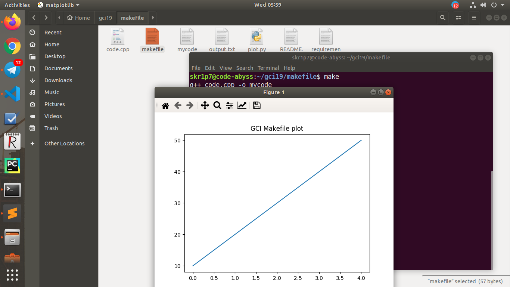

# This repository to detail the use of makefiles (GCI'19 task)

## Usage 

Clone the repository using the command below:

```bash
$ git clone https://github.com/skr1p7/makefiles-101
```

Satisfy the requirements of this repository in order to successfully run the code.
**[NOTE: Make sure you have pip3 and Python3 already installed]**

```bash
$ pip3 install -r requirements.txt
```

Navigate to the **makefiles-101** directory using the following command:

```bash
$ cd makefiles-101
```

Delete the output.txt file as it already has some data that can be plotted, then use the following command to run the makefile:

```bash
$ make
``` 

*-----------------------------------------------------------------------------------*

### Here is a sample output of the makefile

